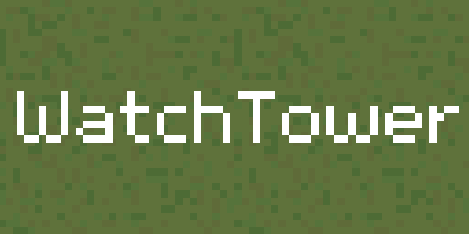

# WatchTower
A Base building survival management game made in Godot.

The overall goal of WatchTower is to build and defend your base from zombies. You can build walls and towers to defend against zombies. Wood, people, crops, and metal are the major resources. Build housing to grow the population, place farms and gardens to grow food, and place walls and towers to defend against the zombies.

*This game is still in development and is not playable in its current state*
